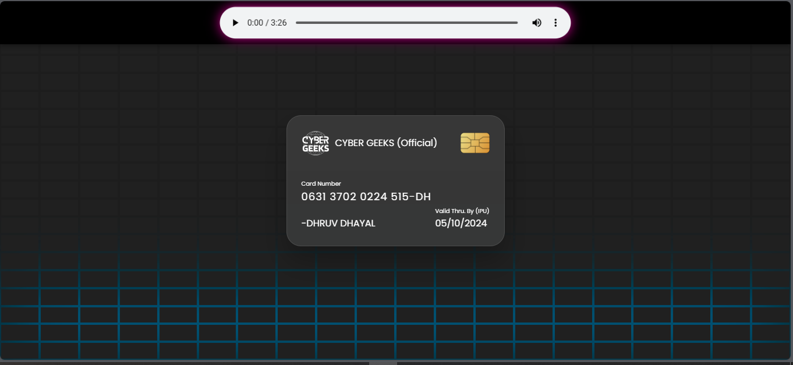
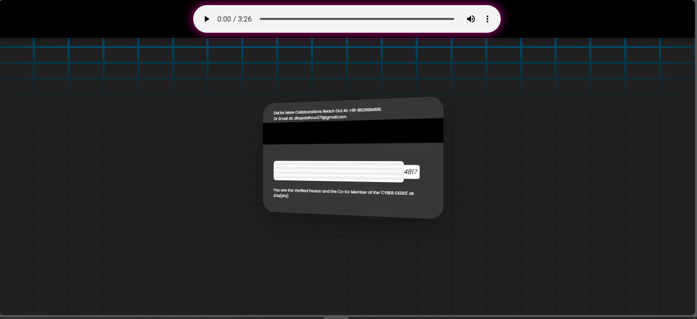

# CYBERGEEKS-Official-Member-Card-
A secure authentication solution that utilizes member cards for access control. Each card features a unique QR code, enabling quick and easy verification while ensuring data protection through advanced encryption. Ideal for organizations looking to enhance security and streamline member management.
Here's a tailored description for your GitHub repository on the Cyber Geeks member card for authentication:

---

# Cyber Geeks Member Card 🛡️💳

  
  

  
  

**Overview:**  
The Cyber Geeks Member Card is a secure authentication system designed to streamline access control for members. This project implements unique member cards featuring QR codes, enabling quick and efficient verification while maintaining data security through encryption.

**Features:**
- **Unique QR Code Generation:** Each member card has a distinct QR code for easy scanning and verification. 📱
- **Secure Authentication:** Advanced encryption techniques ensure member data is protected. 🔒
- **User-Friendly Interface:** Simplifies the access management process for organizations. 🚀
- **Scalable Solution:** Suitable for small to large organizations looking to enhance their security protocols. 

**Technologies Used:**
- Programming Languages: [Insert languages, e.g., Python, JavaScript]
- Frameworks: [Insert frameworks, e.g., Flask, React]
- Database: [Insert database used, e.g., MySQL, MongoDB]

**Getting Started:**
1. Clone the repository.
2. Install dependencies.
3. Configure the environment.
4. Run the application.

**Contributing:**  
Contributions are welcome! Please feel free to submit a pull request or open an issue for discussion.

---

Feel free to customize the **Technologies Used** and **Getting Started** sections based on your project specifics!
